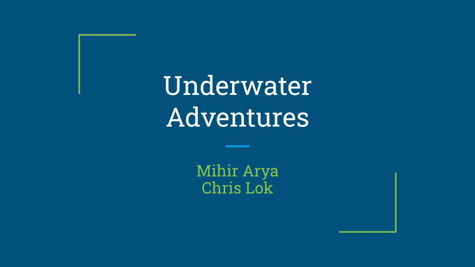
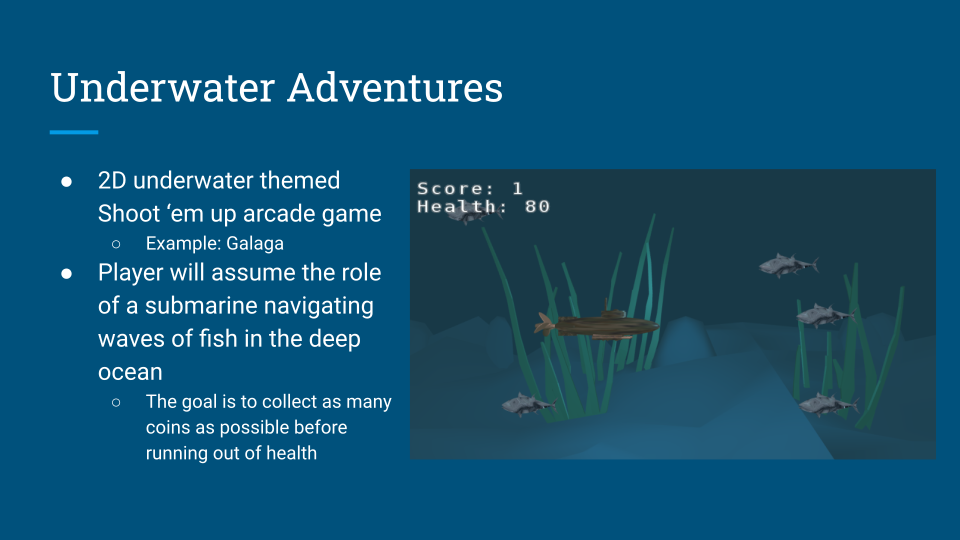
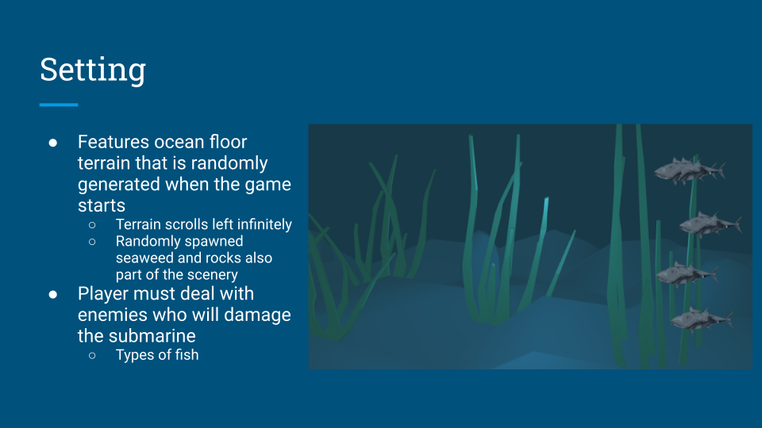
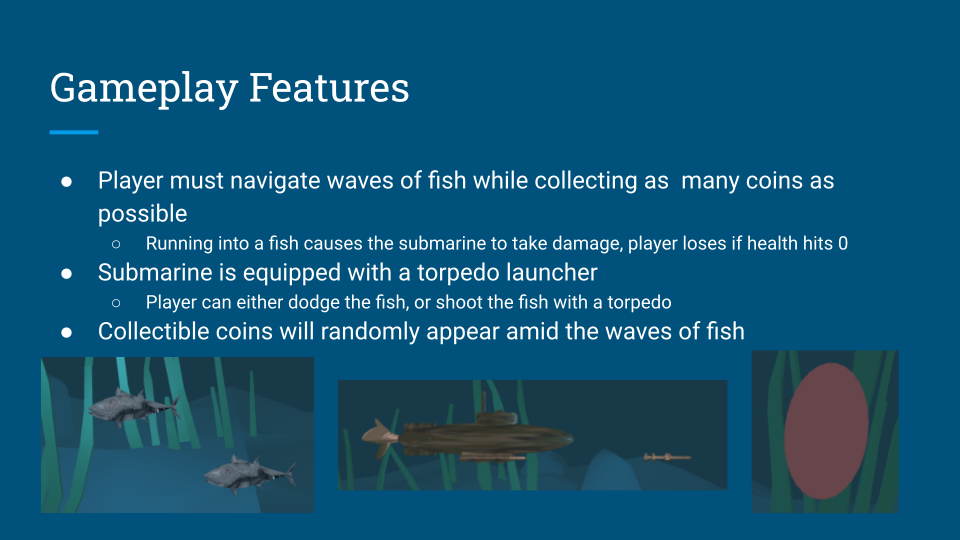
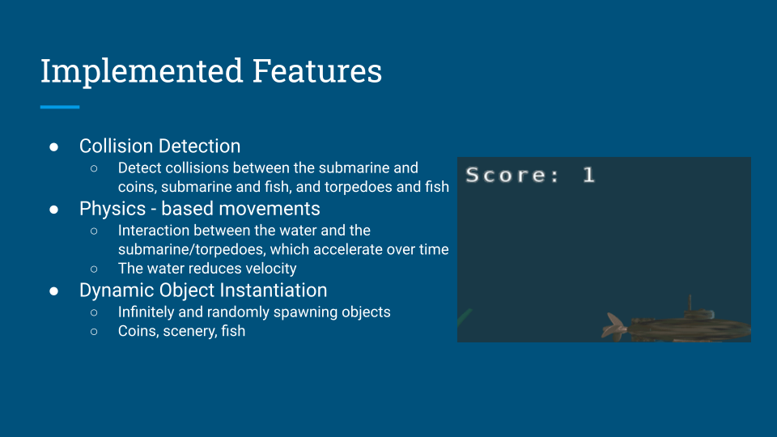
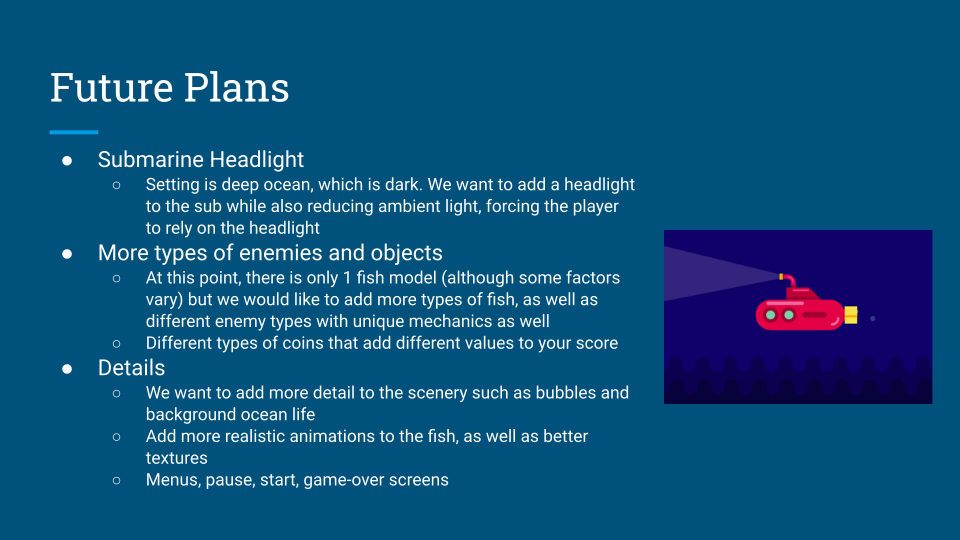

Overview:

          This folder contains all JavaScript code and necessary dependencies for an
          underwater action game. The game utilizes the tiny-graphics library (a subset
          of the popular WebGL library).

Game Semantics:

          Our project is intended to be a 2D underwater themed, ‘shoot ‘em up’ style action 
          game.The game player will assume the role of a submarine, which he/she will have to 
          navigate via up/down and left/right keystrokes. These left/right keystrokes are 
          intended to allow the player to variate submarine speed between a set of lower and 
          upper bounds we set for it. 

Game Objects:

          The objects which the player can interact with consist of pirate treasure coins, 
          enemies the player’s submarine can shoot down with its torpedo, and underwater 
          physical-obstacles. The goal of the player is to collect as many treasure coins 
          as possible before the submarine is out of ‘health’, at which point the game ends. 
          Collisions with enemies lead to the most damage to the submarine. The submarine 
          must either move to avoid such enemies, or shoot them down with its torpedo laser, 
          for which extra treasure coins will be awarded. Underwater physical-obstacles include 
          rocks and coral-reef like plants, and can only be dodged to avoid having health lost.
          tems in the background in the water will include floating bubbles, and swaying seaweed, 
          both of which will be randomly encountered throughout the course of the game. 

Graphics Features:

          The primary advanced feature our game will implement will be collision detection. 
          This will be necessary both in determining collisions between the submarine and 
          physical-obstacles/enemies, but also between the submarine’s torpedo beam and enemies. 
          Physics-based modelling will also be used, to realistically animate the beam of the sub-
          marine in addition to the movement of enemies (intended to be fish at this point in time).
          
          
          
          
The following presentation regurgitates some of the information above and includes game visuals/animations:
          
          
  
  
  
  
  
  
  
  
  
  
  
